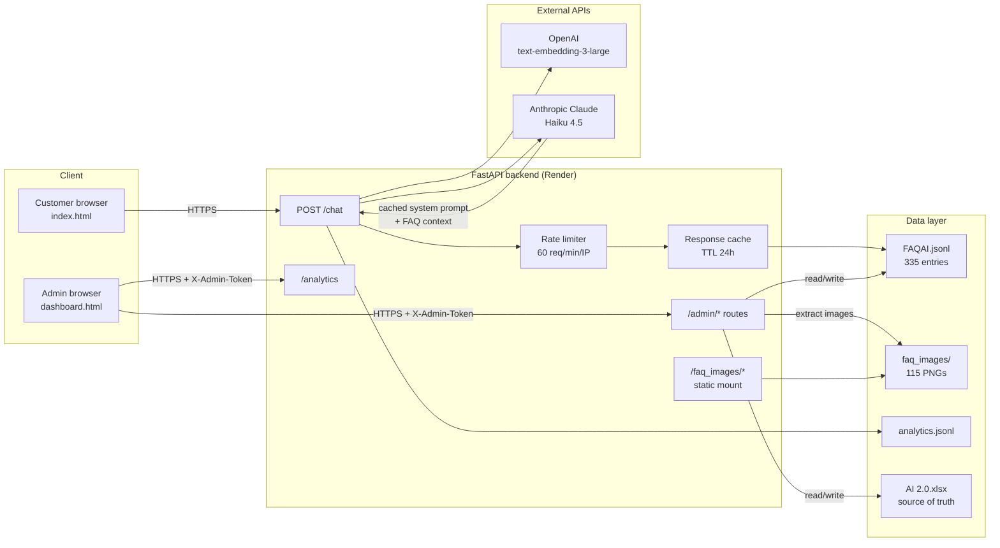

# Wifipool AI Assistant

> Production multilingual customer-support chatbot for Wifipool / Beniferro Belgium — a Retrieval-Augmented Generation (RAG) system built on FastAPI, Anthropic Claude and OpenAI embeddings.

[](https://www.python.org/)
[](https://fastapi.tiangolo.com/)
[](https://www.anthropic.com/)
[](https://render.com/)
[]()

**Live demo:** https://chatbot-piscines.onrender.com
**Admin dashboard:** https://chatbot-piscines.onrender.com/dashboard.html

---

## Table of contents

- [Overview](#overview)
- [Key features](#key-features)
- [Architecture](#architecture)
- [Project metrics](#project-metrics)
- [Quick start (local)](#quick-start-local)
- [Documentation](#documentation)
- [Tech stack](#tech-stack)
- [Production deployment](#production-deployment)

---

## Overview

The Wifipool AI Assistant answers customer questions about pool maintenance, water chemistry, sensor configuration and device troubleshooting in **four languages** (Dutch, English, French, German). It serves as a 24/7 first line of support for Wifipool and Beniferro Belgium, deflecting common SAV requests so the team can focus on complex cases.

The backend is a **FastAPI** application that combines a custom **RAG pipeline** (335 curated FAQ entries with OpenAI embeddings) with **Claude Haiku 4.5** to generate natural, context-aware answers. A password-protected administrative dashboard lets the business owner manage the knowledge base without touching code — including bulk Excel round-trips, instant single-question additions, and multi-image carousel attachments.

This repository covers **everything from data ingestion to deployment**: Excel parser, image extraction, vector indexing, language detection, response caching, analytics tracking, admin auth, rate limiting and CORS configuration.

---

## Key features

### For end users
- **Multilingual** — automatic language detection (NL / EN / FR / DE) with UI toggle override
- **Natural answers** — Claude synthesizes the FAQ knowledge base rather than returning canned responses
- **Multi-image carousel** — answers can reference multiple photos extracted from the master Excel sheet
- **Video links** — YouTube tutorials surfaced inline with the relevant answer
- **Follow-up clarifications** — when a question is ambiguous (e.g. "How do I reset my Wifipool?"), the bot asks "Gen 1 or Gen 2?" and routes to the right answer
- **Suggestions on miss** — when no good match exists, the bot proposes the closest related questions

### For the business owner
- **Admin dashboard** — password-protected, glassmorphism aquatic UI matching the brand
- **Quick add** — one-form entry to add a new Q&A (with optional image / video) in <30 seconds
- **Excel round-trip** — download the master `.xlsx`, edit in Excel, upload back; the chatbot re-indexes instantly
- **Analytics** — most-used language, top-asked questions, coverage gaps (questions the bot couldn't answer)
- **Live re-indexing** — every knowledge base change triggers a re-index in memory; users see the new answer within seconds

### For the engineer (backend & security focus)
- **Token-based admin auth** with `secrets.compare_digest` for timing-attack resistance
- **In-memory rate limiter** (60 req/min/IP) on `/chat` to protect API spend
- **Response cache** with TTL to short-circuit repeated questions
- **Prompt caching** on the Anthropic side (system prompt + FAQ context cached for 5 minutes)
- **Graceful degradation** — fallback to keyword search if embeddings fail; honest error messages if Claude is unreachable
- **CORS** configured for explicit allowed origins + the `X-Admin-Token` custom header

---

## Architecture



The chatbot follows a **retrieval-augmented** pattern:

1. The user query is analyzed for language (FastText-based detector) and intent (preprocessor: greeting, thanks, out-of-scope, real question).
2. For real questions, the query is embedded with `text-embedding-3-large` and matched against the cached FAQ embeddings (cosine similarity).
3. The top-K (8) candidate entries are passed to Claude Haiku 4.5 alongside a system prompt that locks the response to the user's language.
4. Claude generates a natural answer; the row that contributed is identified by `excel_row`, which is used to attach the right image(s) and video to the response.
5. Each interaction is logged in `analytics.jsonl` for the dashboard's language distribution, top-questions and gap-detection reports.

See [docs/ARCHITECTURE.md](docs/ARCHITECTURE.md) for the full design, sequence diagrams, and trade-off reasoning.

---

## Project metrics

| Metric | Value |
|---|---|
| **Python code** | 12 555 lines across `app/` |
| **API endpoints** | 27 (public + admin) |
| **FAQ knowledge base** | 335 curated Q&A entries |
| **Languages supported** | 4 (NL · EN · FR · DE) |
| **Attached media** | 115 images + YouTube videos |
| **Git commits** | 266 |
| **Tracked files** | 180 |
| **Avg `/chat` response** | 4-9 sec warm, 30-60 sec cold start (Render free tier) |
| **Cost / 100 questions** | ≈ $0.75 (Haiku 4.5) |

---

## Quick start (local)

### Prerequisites
- Python 3.11 or higher
- An Anthropic API key ([console.anthropic.com](https://console.anthropic.com))
- An OpenAI API key ([platform.openai.com](https://platform.openai.com))

### Setup

```bash
git clone https://github.com/Wail17/chatbot-piscines.git
cd chatbot-piscines
python -m venv .venv
.venv\Scripts\activate          # Windows
# source .venv/bin/activate     # macOS / Linux
pip install -r requirements.txt
cp .env.example .env            # fill in API keys
python -m uvicorn app.main:app --reload --port 8000
```

Open http://localhost:8000 for the chatbot, http://localhost:8000/dashboard.html for admin (default password `admin`, override via `ADMIN_PASSWORD` env var).

---

## Documentation

| Document | Audience | Purpose |
|---|---|---|
| **[docs/ARCHITECTURE.md](docs/ARCHITECTURE.md)** | Engineers | System design, RAG pipeline, scaling considerations |
| **[docs/SECURITY.md](docs/SECURITY.md)** | Security review | Threat model, OWASP Top 10 mitigations, secret management |
| **[docs/API.md](docs/API.md)** | Integrators | Endpoint reference with request/response examples |
| **[HOW_WE_WORK.md](HOW_WE_WORK.md)** | Project context | Development workflow & decision log |

Interactive API documentation is auto-generated by FastAPI and available at `/docs` once the server is running (OpenAPI 3.0 spec at `/openapi.json`).

---

## Tech stack

**Backend:** FastAPI · Uvicorn · Pydantic · Python 3.11
**LLM:** Anthropic Claude Haiku 4.5 (configurable to Sonnet 4.6 / Opus 4.7)
**Embeddings:** OpenAI `text-embedding-3-large`
**Excel parsing:** openpyxl + custom XML drawing parser for embedded images
**Storage:** JSONL (append-only) + local image directory + AI 2.0.xlsx as source of truth
**Frontend:** Vanilla JS, no framework (lightweight delivery); Chart.js 4.4 for analytics
**Deployment:** Render.com (auto-deploy on push to `main`)
**CI / quality:** Git pre-commit hooks, manual smoke tests via `test_accuracy_live.py`

---

## Production deployment

The application is continuously deployed on **Render** with auto-deploy enabled. Every push to `main` triggers a build and rollout in 2-4 minutes.

**Environment variables required on Render:**

| Variable | Required | Purpose |
|---|---|---|
| `ANTHROPIC_API_KEY` | ✅ | Claude API access |
| `OPENAI_API_KEY` | ✅ | Embedding model access |
| `ADMIN_PASSWORD` | ⚠️ recommended | Override default `"admin"` password |
| `LLM_MODEL` | optional | Override default Haiku 4.5 model ID |
| `TOP_K` | optional | RAG retrieval depth (default 8) |
| `RESPONSE_LANGUAGE` | optional | Force a single language (`"auto"` by default) |

The chatbot is currently served behind HTTPS, with CORS restricted to the deployed origin and an explicit `X-Admin-Token` header allow-list for admin operations. See [docs/SECURITY.md](docs/SECURITY.md) for the full security posture.

---

## License

Proprietary — Wifipool / Beniferro Belgium. Internal development only.

---

*Built as part of an internship at Wifipool / Beniferro Belgium — backend engineering & security.*
