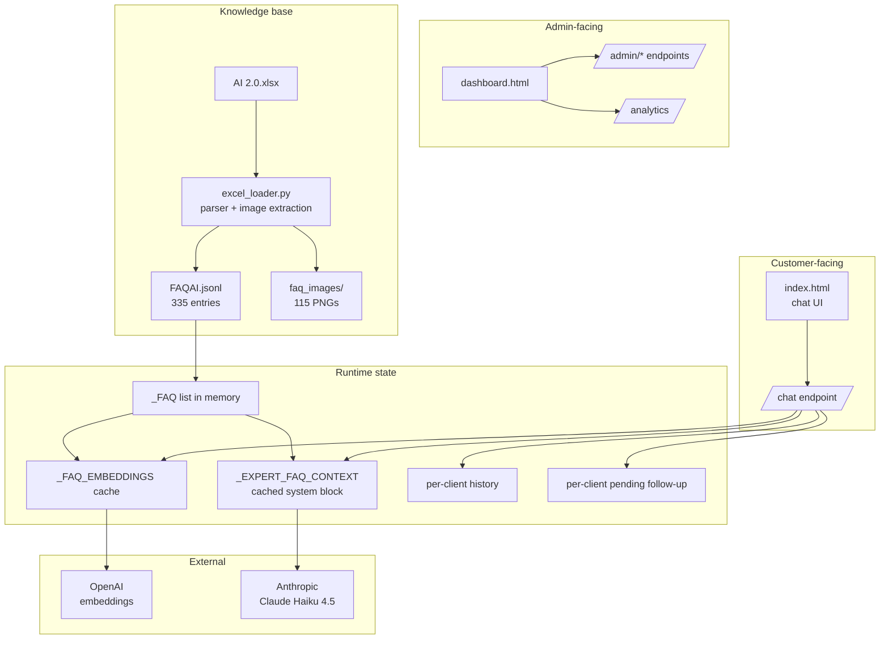
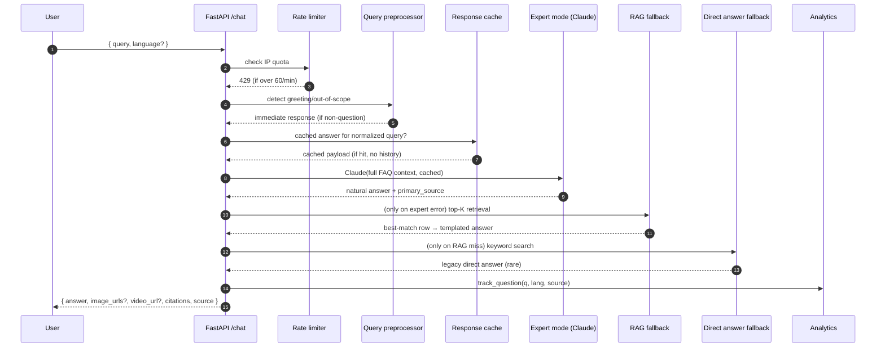
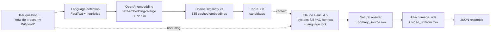
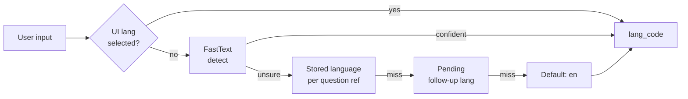

# Architecture

> System design, RAG pipeline internals, data model and scaling considerations for the Wifipool AI Assistant.

---

## 1. High-level design

The application is a **stateless FastAPI service** that serves three concerns:

1. **Public chat endpoint** (`POST /chat`) — answers customer questions.
2. **Admin surface** (`/admin/*`, `/dashboard.html`) — knowledge base management.
3. **Static assets** (`/`, `/dashboard.html`, `/faq_images/*`) — frontend + media.



---

## 2. Request lifecycle: `POST /chat`

The chat handler runs an explicit cascade designed for **graceful degradation**: if any step fails, the next step still produces a usable answer.



### Why three layers?
Each layer is **independently useful** if the next one fails:
- **Expert mode** — best quality (natural prose, multi-row synthesis), but depends on Anthropic being reachable.
- **RAG fallback** — deterministic; returns the closest FAQ row verbatim. Robust to LLM outages.
- **Direct answer fallback** — uses keyword search (BM25-like) when even embeddings fail. Last resort.

In production, > 95% of traffic is served by **expert mode**; the fallbacks exist to ensure the bot never says nothing when Anthropic is down.

---

## 3. The RAG pipeline



### Design decisions

| Decision | Rationale |
|---|---|
| **Stuff full FAQ into context** (not just top-K) | At 335 entries (~43k tokens) it fits comfortably in Claude's 200k window. Lets Claude cross-reference multiple rows when answering. With prompt caching the marginal cost is ~$0.017 per call. |
| **`text-embedding-3-large`** over Voyage / Cohere | Best multilingual quality at the price point; works equally well on NL/EN/FR/DE. |
| **JSONL over a vector DB** | 335 entries is too small to justify Pinecone / Chroma operational complexity. In-memory NumPy cosine is ~1 ms. |
| **Excel as source of truth** | Owner already maintains the FAQ in Excel; we keep that workflow and parse on demand. JSONL is generated from it. |
| **Per-client history & pending state in memory** | Multi-user concurrency is low (one business). Persisting to Redis would add ops cost without UX benefit. Restart loses session — acceptable. |

### When RAG starts losing value

The current "stuff all" approach works up to ~500 FAQ entries. Beyond that, the marginal cost of sending the full context (40k+ tokens) overtakes the cost of a re-rank step. The codebase is already set up for a future migration to **vector-store retrieval + cross-encoder re-rank** (top-K = 20 → Claude rerank → top-5 → final answer).

---

## 4. Data model

### `FAQAI.jsonl` — one JSON object per line

```json
{
  "Categorie": "Wifipool Sturing en meting",
  "Vraag": "Hoe kan ik een toestel manueel starten of stoppen?",
  "Antwoord": "Voer op de pagina met zwembadinstellingen...",
  "alt_questions": [],
  "tags": ["Gen1", "Gen2", "Wifipool"],
  "excel_row": 11,
  "image_paths": ["/faq_images/row_11.png", "/faq_images/row_11_2.png"],
  "image_path": "/faq_images/row_11.png",
  "video_url": "https://youtu.be/...",
  "ENQuestion": "How can I manually start or stop a device?",
  "ENAnswer": "On the Pool settings page, click...",
  "FRQuestion": "...",
  "FRReponse": "...",
  "DEFrage": "...",
  "DEAntwort": "..."
}
```

- **`excel_row`** is the join key back to the source Excel — used by analytics and admin operations.
- **`image_paths`** is the canonical multi-image field; **`image_path`** mirrors the first entry for backwards compatibility.
- Translations are stored verbatim; Claude does not re-translate at query time (saves cost + latency).

### Excel ingestion pipeline

The owner-maintained `AI 2.0.xlsx` is parsed by `app/excel_loader.py`:

1. **`extract_images()`** — walks `xl/drawings/*.xml` + `xl/drawings/_rels/*.rels` to map each anchored image back to its row, then unzips media from `xl/media/*`. Multiple images per row are supported (saved as `row_<N>.png`, `row_<N>_2.png`, …).
2. **`build_entries()`** — uses `openpyxl` to read the typed cells; applies `_repair_answer()` deterministic typo fixes (`oer` → `Voer`, auto-capitalization with technical-term exceptions like `pH`, `RX`, `mV`).
3. **`reload_from_excel()`** — orchestrates 1 + 2, writes JSONL, optionally runs an LLM polish pass (disabled by default to keep ingestion deterministic).

Round-trip is exposed via:
- **`GET /admin/excel/download`** — serves the current `.xlsx`
- **`POST /admin/excel/upload`** — replaces it, backs up last 3 versions, re-indexes
- **`POST /admin/faq/quick-add`** — appends a row + optionally an image, in <1 sec

---

## 5. Multilingual handling



The chatbot **never** auto-translates user output; instead, it instructs Claude to respond in the resolved `lang_code`. This guarantees:
- No translation roundtrip cost
- Identical phrasing across requests in the same language
- The customer-facing translations are owner-validated (stored in Excel)

For follow-up questions ("Gen 1 or Gen 2?"), the language is **pinned to the original question** so a "1" reply in a French conversation triggers a French answer, not an English one.

---

## 6. Caching strategy

| Layer | TTL | Hit rate | Purpose |
|---|---|---|---|
| **Anthropic prompt cache** (system + FAQ context) | 5 min | ~70% during business hours | Avoid re-paying for 43k input tokens every call |
| **Response cache** (normalized query → full response) | 24 h | ~30% on repeat questions | Skip the entire LLM call for FAQs |
| **FAQ embeddings cache** (in-memory numpy) | Process lifetime | 100% after warm-up | Avoid re-embedding 335 entries every request |
| **Expert FAQ context** (concatenated string) | Process lifetime, invalidated on reload | 100% after first build | Avoid re-formatting 43k chars on every call |

The response cache is **disabled when conversation history is non-empty** (so follow-ups don't get stale answers).

---

## 7. Failure modes & graceful degradation

| Failure | Behavior |
|---|---|
| Anthropic API down | Honest localized error ("AI assistant temporarily unavailable, please retry"). No silent wrong answers. |
| OpenAI API down | Falls back to keyword search via `direct_answer.py`. |
| Rate limit hit | HTTP 429 with explicit message. |
| Excel upload corrupt | Backed up version is preserved; previous JSONL remains active. |
| JSONL parse error | Logged with line number; skipped without crashing the loader. |
| Admin token invalid | HTTP 401; frontend wipes sessionStorage and shows login overlay. |

---

## 8. Scaling considerations

### Current scale
- 100 questions/day expected → < 1 question every 14 min.
- Render free tier sleeps after 15 min idle → first-of-day request takes 30-60s. Paid tier ($7/mo) eliminates this.

### Path to 10× scale (1000+ questions/day)
- Move embeddings into a vector DB (Chroma local, or Pinecone if multi-region).
- Add a cross-encoder re-rank (Cohere reranker is $0.001/search) between top-20 retrieval and Claude.
- Move per-client state from in-memory dict to Redis (so multiple Render instances can share session).
- Switch from prompt caching the whole FAQ to dynamically caching the top-K chunks.

### Path to 100× scale
- Split chat / admin into separate services so admin operations can't impact chat latency.
- Stream Claude responses to the client (perceived latency ↓80% even with same total time).
- Pre-translate user questions to NL before retrieval (single embedding language → better recall).

---

## 9. Module map

```
app/
├── main.py                  ← FastAPI routes, lifecycle, follow-up logic (3k+ lines)
├── config.py                ← Env vars, model IDs, top-K, paths
├── rag.py                   ← Expert mode, retrieval, embeddings cache
├── rag_pure.py              ← Pure-RAG legacy path (fallback)
├── rag_optimized.py         ← Hybrid keyword + embedding fallback
├── excel_loader.py          ← XLSX → JSONL + image extraction
├── faq_jsonl.py             ← JSONL loader + embedding manager
├── admin_routes.py          ← /admin/faq CRUD endpoints
├── analytics.py             ← Question tracking, language distribution, gaps
├── response_cache.py        ← TTL-based normalized-query cache
├── query_preprocessor.py    ← Greeting / out-of-scope / spam detection
├── direct_answer.py         ← Keyword-search fallback
├── keyword_search.py        ← BM25-like scoring
├── ingest.py                ← Initial vector store ingestion (legacy)
└── data/
    ├── all/faq/FAQAI.jsonl  ← The knowledge base
    └── faq_images/          ← Extracted PNGs
```

---

*See [docs/SECURITY.md](SECURITY.md) for the security posture and [docs/API.md](API.md) for the endpoint reference.*
