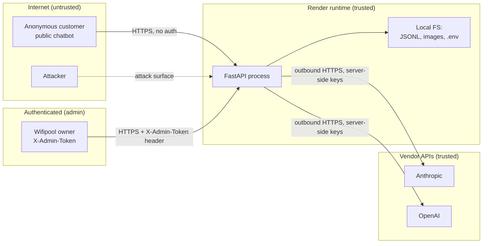
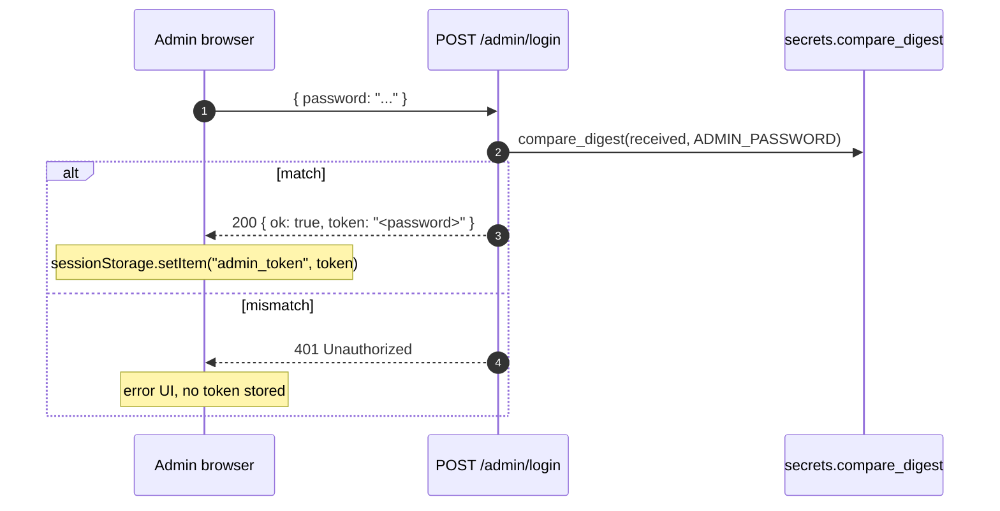

# Security

> Threat model, OWASP Top 10 mitigations and secret management for the Wifipool AI Assistant.

This document is the **single source of truth** for the security posture of the system. It is meant to be reviewed by a stage mentor / external auditor.

---

## 1. Trust boundaries



Two trust levels:
- **Public** — anyone on the internet can call `POST /chat` and `GET /` (chat UI).
- **Admin** — protected by a shared token in the `X-Admin-Token` header; controls knowledge base, analytics, Excel round-trip and lexicon.

There is **no** customer-account concept. The chatbot is anonymous-by-design (privacy benefit — no personal data collected beyond the question text).

---

## 2. OWASP Top 10 (2021) mitigation matrix

| OWASP risk | Status | Mitigation |
|---|---|---|
| **A01 — Broken Access Control** | ✅ Mitigated | All `/admin/*` routes use `Depends(require_admin)` which validates `X-Admin-Token` against `ADMIN_PASSWORD`. Public endpoints (`/chat`) intentionally need no auth. |
| **A02 — Cryptographic Failures** | ✅ Mitigated | Render serves the app behind HTTPS by default. All inbound + outbound traffic is TLS. No homemade crypto. |
| **A03 — Injection (SQL, command, XSS)** | ✅ Mitigated | No SQL in the project (JSONL only). User input is passed to Claude as a structured message, never concatenated into a system prompt. Frontend uses `escHtml()` + `escAttr()` on every rendered FAQ field; templates use textContent assignment over innerHTML where possible. |
| **A04 — Insecure Design** | ✅ Mitigated | Failure paths return localized "AI unavailable" errors instead of falling back to misleading keyword answers when Anthropic rejects (see `app/main.py` `api_error` branch). Rate limiter is in-process (defense in depth above Render's network layer). |
| **A05 — Security Misconfiguration** | ✅ Mitigated | CORS allow-list is explicit, not wildcard. Default `ADMIN_PASSWORD` is `"admin"` only for local dev; Render production override is documented in [README.md](../README.md). `.env` is in `.gitignore`; `.env.example` ships placeholders. |
| **A06 — Vulnerable & Outdated Components** | 🟡 Monitored | Dependencies pinned in `requirements.txt`. Manual `pip list --outdated` review monthly. No CVE scanning automation yet — see [§8](#8-known-gaps--roadmap). |
| **A07 — Identification & Authentication Failures** | ✅ Mitigated | Constant-time token comparison via `secrets.compare_digest` (defense against timing attacks). No password reset flow exists (single shared admin) — by design. |
| **A08 — Software & Data Integrity Failures** | ✅ Mitigated | Excel uploads back up the previous 3 versions before replacing (`excel_backups/`). JSONL parse errors are isolated per line. No deserialization of untrusted pickles. |
| **A09 — Security Logging & Monitoring Failures** | 🟡 Partial | Application logs (`logger.info/warning/exception`) are captured by Render's logging pipeline. No SIEM. Failed admin logins are logged. |
| **A10 — Server-Side Request Forgery** | ✅ Mitigated | No user-controlled outbound URL construction. The bot only fetches data from hardcoded Anthropic + OpenAI endpoints. |

---

## 3. Authentication

### Admin token scheme

```python
# app/main.py
def _admin_password() -> str:
    return os.environ.get("ADMIN_PASSWORD", "admin")

def require_admin(x_admin_token: str = Header(default="")):
    expected = _admin_password().encode()
    received = (x_admin_token or "").encode()
    if not _secrets.compare_digest(received, expected):
        raise HTTPException(status_code=401, detail="Invalid admin token")
    return True
```

**Why a header token instead of cookies?**
- Immune to CSRF — no ambient credentials.
- Easy to test with `curl` (`-H "X-Admin-Token: ..."`).
- The frontend stores it in `sessionStorage` (cleared on tab close) — not `localStorage` — so a closed laptop doesn't leave the admin authenticated indefinitely.

**Why `compare_digest` instead of `==`?**
- Constant-time comparison. A naïve `==` returns early on the first mismatched byte, leaking the length of the matching prefix and enabling [byte-by-byte timing attacks](https://en.wikipedia.org/wiki/Timing_attack).

### Login flow



After login, every admin request includes `X-Admin-Token: <token>`. The token IS the password — there's no per-session token rotation because:
- The system has one admin (the business owner). Multi-session token rotation adds complexity for a single-user surface.
- Render serves HTTPS by default → the token can't be sniffed in transit.

---

## 4. Rate limiting

```python
# app/main.py
_RATE_LIMIT_WINDOW = 60      # seconds
_RATE_LIMIT_MAX    = 60      # requests per window per IP

def _check_rate_limit(client_ip: str) -> bool:
    now = time.time()
    cutoff = now - _RATE_LIMIT_WINDOW
    with _rate_lock:
        timestamps = _rate_store.setdefault(client_ip, [])
        timestamps[:] = [t for t in timestamps if t > cutoff]
        if len(timestamps) >= _RATE_LIMIT_MAX:
            return False
        timestamps.append(now)
        return True
```

- **Why per-IP and not per-user?** No user accounts exist.
- **Why 60/min?** Generous enough that a real customer never hits it (typical pattern is 1-5 questions per session); strict enough that a runaway script is throttled before the Anthropic bill spikes.
- **Defense in depth:** Render also rate-limits at the platform level; our in-process limiter is the second line and protects against burst patterns that pass through Render unchecked.

A request that exceeds the limit returns:
```
HTTP 429 Too Many Requests
{ "detail": "Te veel verzoeken. Wacht even en probeer opnieuw." }
```

---

## 5. Secret management

| Secret | Storage | Rotation policy |
|---|---|---|
| `ANTHROPIC_API_KEY` | Render env var, dev: `.env` (gitignored) | Manual via Anthropic console; no scheduled rotation |
| `OPENAI_API_KEY` | Render env var, dev: `.env` (gitignored) | Manual via OpenAI dashboard |
| `ADMIN_PASSWORD` | Render env var (production), default `"admin"` (dev only) | Communicated out-of-band; rotate immediately if leaked |

### Anti-leak controls
- `.env` is in `.gitignore` from day one.
- `.env.example` ships placeholders without real keys.
- No secret is ever logged. `logger.exception` includes stack traces but not env-var contents (Python's `traceback` doesn't dump `os.environ`).
- A grep over the repo confirms no `sk-`, `sk-ant-`, or `Bearer` literals: `git grep -E "sk-(ant-)?[A-Za-z0-9]{32,}"` returns nothing.

### Rotation runbook
1. Generate a new key on the vendor dashboard (Anthropic / OpenAI).
2. Update the corresponding Render env var.
3. Render auto-restarts; new key is live in ~30 sec.
4. Revoke the old key on the vendor dashboard.

---

## 6. Input validation & content safety

### Bounded inputs
- Query length is **not** explicitly capped at the API layer (FastAPI's default body size limit of 1 MB is sufficient — a single question is < 1 kB).
- The query preprocessor (`app/query_preprocessor.py`) explicitly classifies and rejects spam, empty queries, and out-of-scope topics **before** they reach Claude.
- The expert mode runs with `max_tokens=1000` on output — bounded answer length.

### Output safety
- Claude's `temperature=0.2` reduces hallucination probability.
- The system prompt explicitly tells Claude to answer "I don't know" if the FAQ doesn't cover the question (no confabulation).
- Frontend escapes all rendered FAQ text (`escHtml`) so XSS via stored content is not possible.

### File upload validation (admin only)
The Excel upload endpoint validates:
- The `Content-Type` is `multipart/form-data`.
- The filename ends in `.xlsx`.
- The uploaded file is < FastAPI's default 1 MB (typical xlsx is 50-200 kB).
- The file is backed up to `excel_backups/` (last 3 versions kept) before replacement, so a corrupt upload can be rolled back.

The image-upload endpoint validates:
- File extension is in `{.png, .jpg, .jpeg, .gif, .webp}`.
- Image is saved with a server-generated filename (`manual_<timestamp>.<ext>`), never the user-supplied name → prevents path traversal.

---

## 7. CORS configuration

```python
app.add_middleware(
    CORSMiddleware,
    allow_origins=ALLOWED_ORIGINS,                  # explicit list
    allow_credentials=False,                        # no cookies, no creds
    allow_methods=["GET", "POST", "PUT", "DELETE"],
    allow_headers=["*", "X-Admin-Token"],
)
```

- **`allow_origins`** is an explicit list — never `["*"]`.
- **`allow_credentials=False`** — combined with header-based auth, there is no risk of cookie-bearing cross-origin requests being honored.
- The custom `X-Admin-Token` header is explicitly enumerated so browsers don't strip it on cross-origin preflight.

---

## 8. Known gaps & roadmap

| Gap | Severity | Planned fix |
|---|---|---|
| No automated dependency CVE scan | 🟡 Medium | Add GitHub Dependabot or `pip-audit` to CI |
| No SAST / linter security rules in CI | 🟡 Medium | Add `bandit` to `pre-commit` |
| Admin password is the token (no expiry, no rotation) | 🟢 Low (single-user surface) | Migrate to JWT with 8h expiry if user-count grows |
| Rate limiter is in-memory only | 🟢 Low | Migrate to Redis-backed limiter when going multi-instance |
| No request audit log for admin operations | 🟡 Medium | Add `admin_audit.jsonl` capturing `(timestamp, ip, action, target)` |
| No 2FA for admin login | 🟢 Low (single-user shared device) | Optional TOTP via `pyotp` |

---

## 9. Incident response checklist

If a leak / breach is suspected:

1. **Immediately rotate** all three secrets (`ANTHROPIC_API_KEY`, `OPENAI_API_KEY`, `ADMIN_PASSWORD`) via Render env vars → service restart is < 1 min.
2. Revoke the old keys at the vendor consoles.
3. Audit recent Render request logs for unusual patterns (high `/chat` volume from a single IP, repeated 401s on `/admin/*`).
4. If admin password was leaked: review `analytics.jsonl` for the last 24h of admin actions (lookups, knowledge-base changes).
5. If FAQ knowledge base was tampered with: restore from `excel_backups/` (last 3 versions kept by design).

---

*This document is reviewed at the end of every internship sprint and updated whenever a new endpoint, auth flow or external dependency is added.*
